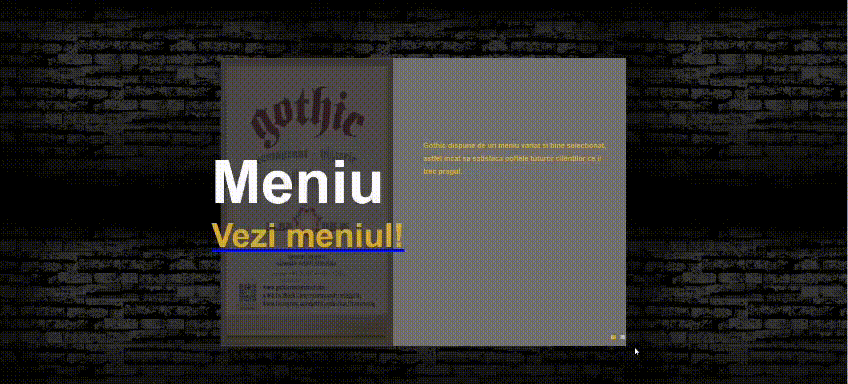
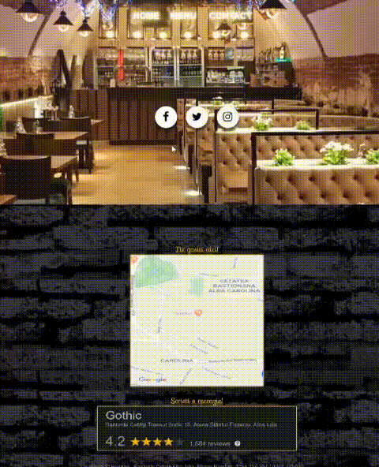
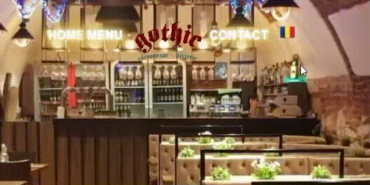

# Gothic Restaurant Website

## Overview

This project is a fully responsive, multi-language website developed for **Gothic Restaurant**, located in the historic Alba Iulia Citadel. It was built using **HTML**, **CSS**, and **JavaScript** to provide a seamless, user-friendly experience. The website features an interactive menu, a gallery of restaurant images, contact information, and social media integration, and supports language switching between Romanian and English.

The website emphasizes a dynamic and elegant design, with attention to details such as responsive layouts, high-quality visuals, and smooth navigation.

## Key Features

- **Responsive Design**: Adapts to different screen sizes, ensuring a smooth experience on desktop, tablet, and mobile.
- **Multi-language Support**: Users can switch between Romanian and English.
- **Interactive Slideshow**: Displays images of the menu and the restaurant gallery with custom animations.
- **Menu Page**: A well-structured menu showcasing different food categories like breakfast, drinks, and desserts.
- **Gallery Page**: A collection of images showing the restaurant interior, ambiance, and dishes.
- **Contact Page**: Includes a contact form, Google Maps integration for location, and phone numbers.
- **Social Media Integration**: Links to the restaurant's social media profiles are displayed using interactive icons.

## Technologies Used

- **HTML5**: For the structure of the website.
- **CSS3**: For styling, layout, and responsiveness (including media queries for screen size adaptability).
- **JavaScript**: To add interactive features such as the slideshow and dynamic elements in the menu and gallery.
- **Font Awesome**: For icons used throughout the site, including social media links and service icons.
- **Google Maps API**: For embedding the restaurant's location in the contact page.

## Project Structure

```
/project-root
│
├── /images                   # Contains images used on the website (logo, gallery, etc.)
│
├── /Menu images              # Contains images specific to the menu
│
├── /css
│   ├── style.css             # Main CSS file for general styling
│   └── social.css            # CSS file for social media integration
│
├── index.html                # Main home page (default)
├── Menu.html                 # Menu page for listing food categories and dishes
├── galerie.html              # Gallery page showcasing images of the restaurant and food
├── contact.html              # Contact page with restaurant details and Google Maps integration
├── LICENSE                   # License file (MIT)
└── README.md                 # This README file
```

### Main CSS Features

- **Custom Backgrounds**: Various sections of the website use background images to reflect the Gothic ambiance.
- **Flexbox Layout**: Used extensively for creating responsive designs that adjust based on screen size.
- **Hover Effects**: CSS transitions and hover states for buttons and images to enhance user interaction.
- **Slideshow**: Custom-built JavaScript slideshow for dynamic content display.
  
### JavaScript Functions

- **Slideshow Controls**: Functions for navigating between images in the slideshow.
- **Dynamic Transitions**: Custom transitions and animations applied to content within the slideshow to create a smooth and visually appealing experience.
- **Dropdown Menus**: JavaScript functions enable dropdowns in the navigation for better mobile usability.
- **Language Toggle**: Implemented language switching functionality using JavaScript for a better user experience across different regions.

## Running the Project

To run the website locally:

1. Clone the repository:
   ```bash
   git clone https://github.com/your-username/Gothic-Restaurant-Website.git
   ```

2. Navigate into the project directory:
   ```bash
   cd Gothic-Restaurant-Website
   ```

3. Open the `index.html` file in your browser:
   ```bash
   open index.html
   ```

## Future Improvements

- Implement an online **reservation system** for customers.
- Add **social media sharing** functionality for menu items or gallery images.
- Enhance the **SEO** to improve search engine ranking and visibility.
- Improve the **accessibility** of the website, making it more inclusive to all users.
- Add **backend support** to handle form submissions from the contact page.

## GIFs

Here are some key interactions and features of the Gothic Restaurant Website:

### 1. Homepage Slideshow
This shows the dynamic slideshow on the homepage featuring the menu and gallery.


### 2. Menu Page
Displays the menu categories and items with a sleek design.


### 3. Gallery Page
A showcase of the restaurant’s food and ambiance through the gallery.


### 4. Contact Page
Includes contact details, a map with the restaurant’s location, and a contact form.


### 5. Language Switcher
Demonstrates the language toggle feature between Romanian and English.


## Live Demo

You can view the live version of the website [here](https://chris91ss.github.io/Gothic-Restaurant-Website/).

## Contribution

Contributions are welcome. Follow the steps below to contribute to this project:

1. Fork the repository.
2. Create a new branch for your feature or bug fix:
   ```bash
   git checkout -b feature-name
   ```
3. Commit your changes:
   ```bash
   git commit -m "Describe your feature"
   ```
4. Push the branch:
   ```bash
   git push origin feature-name
   ```
5. Create a pull request to the `main` branch.

## License

This project is licensed under the MIT License. See the [LICENSE](LICENSE) file for more details.
```
